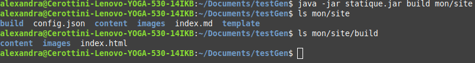
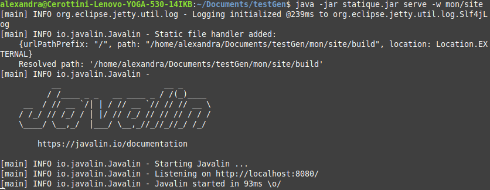

# Manuel utilisateur pour le générateur de site statique

## Installation

Téléchargez la dernière release (le `.jar`) disponible sur le [git](https://github.com/gen-classroom/projet-besseau_cerottini_maziero_ogi/releases). Pour lancer le programme, mettez vous à l'emplacement du `.jar` et utilisez la commande `java -jar <release>.jar`. Ceci devrait produire l'affichage de l'utilisation des différentes commandes.


## Commandes

### Version

Pour afficher la version actuelle du générateur de site statique, utilisez la commande `java -jar <release>.jar -v`.

### Init

Pour initialiser le site statique, utilisez la commande `java -jar <release>.jar init <dossier>`. Cette commande permet de créer ou enrichir le dossier mentionné. Un fichier `index.md`, un fichier `config.json` ainsi qu'un dossier `template` contenant un fichier `default.html` seront créés.

### Build

Pour compiler le site statique, utilisez la commande `java -jar <release>.jar build [-w] <dossier>`.  Le **-w** est optionnel. Il permet d'activer le file watcher. Si un fichier est modifié lors de l'exécution, il sera reconverti. Cette commande va créer un dossier `build` dans le dosser `<dossier>` contenant un fichier `index.html` ainsi que les fichiers `.md` transformé en `.html`.

### Serve

Pour visualiser le résultat de la compilation dans un navigateur web, utilisez la commande `java -jar <release>.jar serve [-w] <dossier>`.  Le **-w** est optionnel. Il permet d'activer le file watcher. Si un fichier est modifié lors de l'exécution, il sera reconverti. Il suffit de taper `localhost:8080` sur un navigateur web pour visualiser le résultat. La page par défaut sera le `index.html`. Pour naviguer dans les autres fichier `.html`, il faut préciser leur chemin dans l'URL.

### Clean

Pour nettoyer le site statique, utilisez la commande `java -jar <release>.jar clean <dossier>`. Cette commande supprimera le dossier `build` dans le dossier `<dossier>`.


## Ajout du contenu utilisateur

### Dossiers réservés

`build` et `template` sont des dossiers spéciaux. Tous les fichiers en format Markdown inclus seront ignorés. Le dossier `build ` est utilisé comme sortie pour la conversion des fichiers Markdown et le dossier `template` est utilisé pour stocker les modèles pour le site.

### Utilisation du template

L'utilisation de [handlerbars](https://handlebarsjs.com/) est recommendé pour décrire un modèle de page.

Un modèle par défaut est automatiquement appliqué à tous les fichiers pour lesquels aucun modèle n'est spécifié. Le modèle par défaut est situé dans le dossier `template/default.html`.

### Insérer du contenu dans un template

Pour spécifier où insérer du contenu dans le template, il faut utiliser `{{INSERT}}`.

À l'intérieur des accolades, vous pouvez spécifier les propriétés à afficher.

Par exemple, si vous voulez accéder à vos méta-données globales (définies dans `config.json`), vous pouvez utiliser `{{site:member}}` où member est la propriété à laquelle vous voulez accéder. Sinon, si vous voulez accéder aux méta-données de votre fichier, vous pouvez utiliser `{{page:member}}`. Enfin, pour afficher le contenu de votre page, utilisez `{{md content}}`. Il y a aussi possibilité d'ajouter du contenu brut (texte).

La conversion échoue si des métadonnées sont attendues par le template mais qu'elles ne sont pas présentes.

### Lien sur un autre fichier

Le générateur de statique supporte les liens vers d'autres fichiers. De plus, les liens vers d'autres fichiers md seront transformés en liens vers des fichiers html. Par exemple :

`[Une autre page](./test/page.md)` sera transformé en `<a href="./test/page.html">Une autre page</a>`.

### Limitations

Il ne doit pas y avoir d'espace entre les accolades. Par exemple : `{{ site.content }}` ne fonctionnera pas.

### Fichier Markdown

Dans les fichiers Markdown, il faut obligatoirement séparer les metadatas du contenu avec les caractères `---` même si le fichier ne contient aucune metadata.

Quelques exemples:

Fichier correct:

```
template:noMeta
---
# No metaData
Actually it has a metaData to specify the template to use but otherwise it only has global meta-data accesible.
```

Fichier incorrect:

```
# No metaData
Actually it has a metaData to specify the template to use but otherwise it only has global meta-data accesible.
```

Fichier correct:

```
---
# No metaData
Actually it has a metaData to specify the template to use but otherwise it only has global meta-data accesible.
```


## Build le projet

```
mvn clean install
```

Il faut qu'il y ait un `statique.jar` dans le dossier `target`.


## Divers

Si vous utilisez un IDE, vous pouvez ajouter `-Dpicocli.ansi=TRUE` dans l'option vm afin d'activer la coloration dans votre terminal.


## Exemple

Voici un exemple pratique pour vous permettre de mieux comprendre l'utilisation du générateur de site statique.

Nous allons commencer par afficher la version du générateur de site statique avec la commande `java -jar <release>.jar -v`.


Nous allons dans un second temps initialiser notre site statique avec la commande `java -jar <release>.jar init mon/site`.


Nous allons maintenant ajouter deux templates dans notre dossier `template` (en plus du `default.html`) déjà existant.

`index.html`:

```html
<html lang="en">
<head>
      <meta charset="utf-8">
      <title>{{site:title}} | {{page:title}}</title>
</head>
<body>
      
      Author: {{page:author}}
      {{md content}}
      {{> menu}}
</body>
</html>
```

Ce template comporte la particularité d'insérer un autre fichier avec `{{> menu}}`. Le fichier `menu.html` sera inséré à cet emplacement.

`menu.html`:

```html
<ul>
    <li> <a href="index.html"> home </a> </li>
    <li> <a href="content/page.html"> page </a> </li>
</ul>
```

`noMeta.html`:

```html
<html lang="en">
<head>
      <meta charset="utf-8">
      <title>HELP ME</title>
</head>
<body>
      {{md content}}
</body>
</html>
```

Ce template peut être appliqué pour des fichiers n'ayant pas de métadonnées.

Nous allons également ajouter un dossier `content` à `mon/site`. Nous y créons deux fichiers Markdown.

`page.md`:

```markdown
title:ChessClub
author:Thub
---
# Hello there
Date: 08.05.2021 
___


Sadly No music
```

`noMeta.md`:

```markdown
template:noMeta
---
# No metaData
Actually it has a metaData to specify the template to use but otherwise it only has global meta-data accesible.
```

Nous modifions l'`index.md`.

```markdown
title:MysuperbExamble
author:Guy
template:index
---
# My superb example
Date: 08.05.2021 
___
Welcome to my example. 

[You can follow this link to see another page](content/page.md)

[Or another one](content/noMeta.md)

This is an image:


Have fun
___
```

Nous créons un dossier `images` dans lequel nous ajoutons nos deux images `Usage.png` et `putin.gif`.

Nous allons dans un troisième temps compiler notre site statique et activer le fileWatcher avec la commande `java -jar <release>.jar build mon/site`.



Nous allons ensuite visualiser notre site statique et activer le fileWatcher avec la commande `java -jar <release>.jar serve -w mon/site`.



En allant sur un navigateur web et en tapant `localhost:8080`, nous sommes capables de visualiser le résultat.


Nous remarquons tout à coup une faute d'ortographe dans le titre de la page.


Nous reprenons donc notre fichier `index.md` et modifions la premire ligne `title:MysuperbExamble` par `title:MysuperbExample`. Nous sauvgardons puis rechargeons la page du site web et nous voyons que la modification a bien été effectuée.


Pour terminer, nous allons nettoyer notre site statique avec la commande `java -jar <release>.jar clean mon/site`.


Vous pouvez retrouver les différents dossiers utilisés pour l'exemple [ici](https://github.com/gen-classroom/projet-besseau_cerottini_maziero_ogi/tree/master/exemple).

