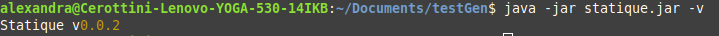

# Manuel utilisateur pour le générateur de site statique

## Installation

Téléchargez la dernière release (le `.jar`) disponible sur le [git](https://github.com/gen-classroom/projet-besseau_cerottini_maziero_ogi/releases). Pour lancer le programme, mettez vous à l'emplacement du `.jar` et utilisez la commande `java -jar <release>.jar`. Ceci devrait produire l'affichage de l'utilisation des différentes commandes.

## Commandes

### Version

Pour afficher la version actuelle du générateur de site statique, utilisez la commande `java -jar <release>.jar statique -v`.

### Init

### Build

### Serve

### Clean

## Exemple

Voici un exemple pratique pour vous permettre de mieux comprendre l'utilisation du générateur de site statique.

Nous allons premièrement commencer par afficher la version du générateur de site statique avec la commande `java -jar <release>.jar statique -v`.

l'utilisateur peut saisir du contenu en markdown qui sera compilé en html.

Les pages créées contiennent des métadonnées et du contenu (format des pages)

on peut voir la version

on peut initialiser le site --> statique init /mon/site peut créer ou enrichir le dossier /mon/site avec un fichier de conf config.yaml qui contient des infos générales liées au site (titre, description, domaine) et un fichier markdown index.md contenant une page d’accueil avec des métadonnées et du contenu. Le fichier config.yaml contient les données de configuration du site

le html correspondant à mes fichiers markdown soit injecté dans des pages html plus complètes à l'aide d'un template. Dans le site statique y'aura un template qui sera utilisé lors de l'exécution de la commande build pour générer les pages html.

On peut compiler le site --> statique build /mon/site crée un dossier /mon/site/build contenant un fichier HTML correspondant au contenu de chaque page du site statique. Les fichiers de conf sont pas ajouté au dossier build.

On peut nettoyer le site -->statique clean /mon/site pour nettoyer le site statique. Elle supprime le dossier /mon/site/build

On a la release du générateur de site statique téléchargeable sur git avec les instructions d'installation.

On peut visualiser le résultat de la compilation du site Internet dans un navigateur web -> statique serve /mon/site

buil et serve regénère à la volée (automatiquement) les changements qui sont effectués sur le système de fichier.

statique init chemin ...

on pourrait faire direct un build si on a deja nos dossier. Le init crée une base

clean pour enlever le folder build dans le path

serve pour lancer un serveur permettant de voir le site statique.

